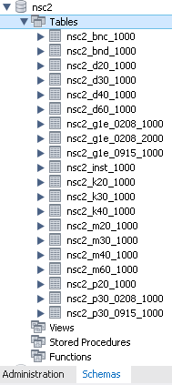

# 건강보험 공공데이터 활용


---


## 개요

최근 공공데이터 활용 사례가 늘어나고 있는 추세이다<br/>
[국민건강보험 공단](https://nhiss.nhis.or.kr/)에서는 이런 추세에 발 맞추어서 건강보험 DB 를 활용할 수 있는 자료를 공개하고 있다<br/>
건강보험 활용 교육자료는 [이곳](https://nhiss.nhis.or.kr/bbs/boards/notice/963.do) 에서 받을 수 있다<br/>
<br/>
그런데 자료의 파일 포맷이 [SAS](https://www.sas.com/) 와 CSV 형태이다<br/>
SAS 는 통계/분석 전문가들에게는 친숙할 수 있으나 일반 개발자들은 RDBMS 가 상대적으로 접근성이 용이하다<br/>


---


## 건강보험 DB 테이블 명세서

건강보험 활용 데이터에서 `2교시 테이블 세부 레이아웃 소개.pdf` 파일을 기준으로 작성한 DB 테이블 명세서이다

- [건강보험 테이블 명세서](nsc_DB_Table_Definition.md)


---


## 건강보험 DB DDL

건강보험 활용 데이터에서 `2교시 테이블 세부 레이아웃 소개.pdf` 파일을 기준으로 작성한 DB 테이블 새성 스크립트이다


- [건강보험 MySQL DDL](nsc_mysql_ddl.md)

- [건강보험 PostgreSQL DDL](nsc_postgresql_ddl.md)


---


## MySQL 에서 csv 임포트

MySQL 에서 csv 를 임포트 하는 방법은 여러가지가 있으나 이 장에서는 mysql 명령줄을 사용한다

먼저 [[건강보험 MySQL DDL]] 를 이용해서 DB 테이블을 생성한다

MySQL Workbench 의 Schemas 탭에서 생성된 DB 테이블을 확인한다



명령 프롬프트에서 다음과 같이 입력하여 mysql 에 접속한다

```
> mysql --host=localhost --port=3306 --user=[DB 계정] --password=[DB 암호] [DB 이름]
```

mysql 명령 줄에서 다음과 같이 입력하면 CSV 파일을 임포트하게 된다

```
mysql> LOAD DATA LOCAL INFILE 'C:/SMPL_1000_CSV/NSC2_BNC_1000.CSV' INTO TABLE NSC2_BNC_1000 FIELDS TERMINATED BY ',' IGNORE 1 ROWS;
Query OK, 13073 rows affected, 419 warnings (1.26 sec)
Records: 13073  Deleted: 0  Skipped: 0  Warnings: 419

mysql>
```

mysql 명령 줄에서 임포트된 테이블의 데이터 확인

```
mysql> SELECT * FROM NSC2_BNC_1000 LIMIT 5;
+---------+----------+------+-------+-------------+----------+-------------+-------------+------------+--------------+
| RN_INDI | STD_YYYY | SEX  | SGG   | GAIBJA_TYPE | CTRB_Q10 | DSB_SVRT_CD | DSB_TYPE_CD | G1E_OBJ_YN | SMPL_TYPE_CD |
+---------+----------+------+-------+-------------+----------+-------------+-------------+------------+--------------+
|    2270 |     2002 |    2 | 42110 |           2 |        8 |             |             |            |            1 |
|    2270 |     2003 |    2 | 41281 |           1 |        5 |             |             |            |            1 |
|    2270 |     2004 |    2 | 45111 |           1 |        4 |             |             |            |            1 |
|    2270 |     2005 |    2 | 45111 |           1 |        6 |             |             |            |            1 |
|    2270 |     2006 |    2 | 45111 |           1 |        4 |             |             |            |            1 |
+---------+----------+------+-------+-------------+----------+-------------+-------------+------------+--------------+
5 rows in set (0.00 sec)

mysql>
```

> Note
>
> MySQL 은 INT 데이터 형에 NULL 값을 줄 수 없어서 값이 없는 필드의 경우 경고 메시지가 출력된다


