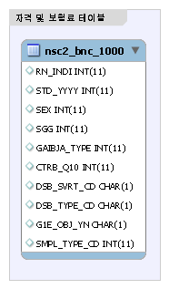
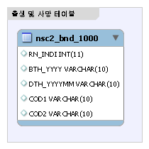
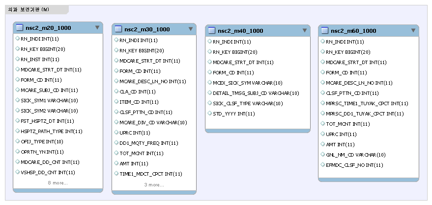
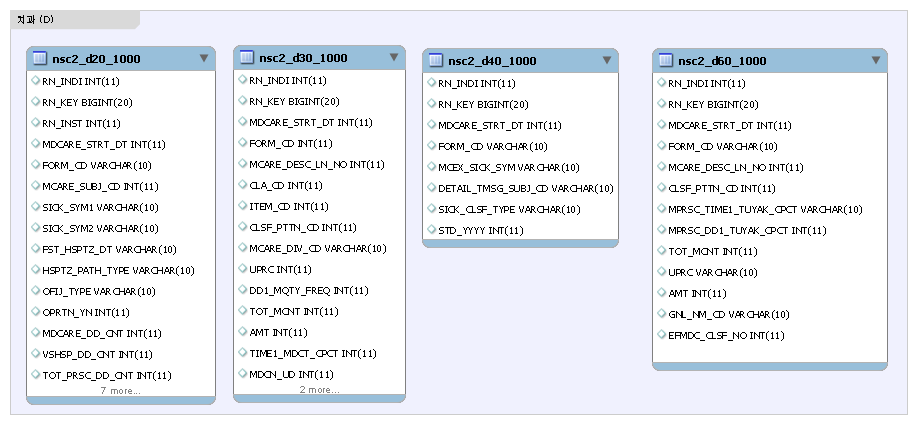
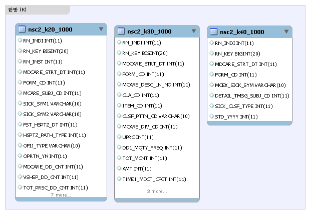
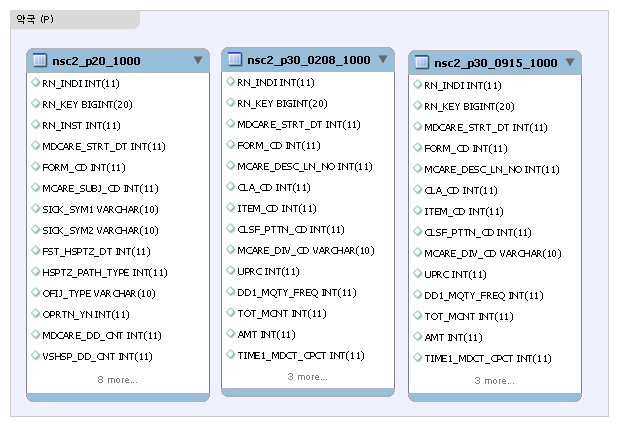

# 건강보험 테이블 명세서

- [건강보험 빅데이터 활용 교육 실습 자료  기반](https://nhiss.nhis.or.kr/bbs/boards/notice/963.do)

> Note:
>
> **의과_보건기관 (M) / 치과 (D) / 한방 (K) / 약국 (P) 간에 테이블 구조가 같다**
>
> **단 한방 (K) 는 처방전 교부 상세 (_k60) 테이블은 없다**>
> **또한 약국 (P) 는 상병내역 (_p40) 과 처방전 교부 상세 (_p60) 테이블은 없다**

---

## Tables

### 자격 및 보험료 테이블

|Table Name|Table Comment
|---|---|
|[nsc2_bnc_1000](#nsc2_bnc_1000)| 자격 및 보험료 테이블  자격자료(사회경제적 변수) : 각 해당년도 연초 자격 기준  - 건강보험가입자 및 의료급여 수급권자로 구성 (외국인 제외) 직장 및 지역가입자 각 10분위, 의료급여수급권자 0분위(null 값)  ※ 직장, 지역의 같은 분위가 같은 소득수준을 뜻하는 것은 아님 ※ 의료급여 대상자의 보험료는 결측 |

#### nsc2_bnc_1000

자격 및 보험료 테이블

|Field|Type|Required|Key|Default|Comment|
|---|---|---|---|---|---|
|**RN_INDI**|int(11)|NO|||개인고유번호(7자리), 연계변수 (주민등록번호의 대체 식별번호)|
|**STD_YYYY**|int(11)|NO|||기준년도 (2002\~2015년 자격 및 의료이용 해당년도)|
|**SEX**|int(11)|NO|||성별 (1: 남자, 2: 여자)|
|**SGG**|int(11)|NO|||시군구  시도 2자리와 시군구 3자리로 구성 해당년도의 유효 시군구 정보|
|**GAIBJA_TYPE**|INT(11)|NO|||가입자 구분  1: 지역세대주 2: 지역세대원 5: 직장가입자 6: 직장피부양자 7: 의료급여세대주 8: 의료급여세대원|
|**CTRB_Q10**|int(11)|NO|||보험료분위 10분위 (직장 및 지역가입자 각 10분위, 의료급여수급권자 0분위)|
|**DSB_SVRT_CD**|char(1)|NO|||장애중증도 구분  0: 해당없음 1: 중증 (1\~2등급) 2: 경증 (3\~6등급)|
|**DSB_TYPE_CD**|char(1)|NO|||장애유형 구분  주요 장애 (지체, 뇌병변, 시각, 청각장애) 외의 장애는 기타장애로 그룹화|
|**G1E_OBJ_YN**|char(1)|NO|||건강검진 (일반 1차) 대상자 여부 (Y: 대상자)|
|**SMPL_TYPE_CD**|int(11)|NO||||

---

### 출생 및 사망 테이블

|Table Name|Table Comment
|---|---|
|[nsc2_bnd_1000](#nsc2_bnd_1000)|출생 및 사망 테이블 개요  내용 : 표본의 출생연도, 사망연월 및 사망원인 정보  연령 :  -  대상자의 출생년도로 연령 산출 시 ‘기준년도’-‘출생년도’계산 필요 -  2006년 기준 85세 해당(1921년 및 그 이전 출생자)자 출생연도 ‘1921LE’|

#### nsc2_bnd_1000

출생 및 사망 테이블

|Field|Type|Required|Key|Default|Comment|
|---|---|---|---|---|---|
|**RN_INDI**|int(11)|NO|||개인고유번호(7자리), 연계코드|
|**BTH_YYYY**|varchar(10)|NO|||출생연도|
|**DTH_YYYYMM**|varchar(10)|NO|||사망자의 사망월 ... 통계청 사망원인 연계|
|**COD1**|varchar(10)|NO|||- 범위 : A00-T98 -  일반적인 사망(소분류), 민감사인(중분류)|
|**COD2**|varchar(10)|NO|||- 범위 : V01-Y98 - 사망원인1이 한국표준질병사인분류표의 대분류 19장(손상, 중독 및 기타 외인에 의한 특정결과(S00-T98))에 해당되는 경우 사망원인2 추가제공|

---

### 의과_보건기관 (M)

|Table Name|Table Comment
|---|---|
|[nsc2_m20_1000](#nsc2_m20_1000)|진료 명세서|
|[nsc2_m30_1000](#nsc2_m30_1000)|진료내역|
|[nsc2_m40_1000](#nsc2_m40_1000)|상병내역|
|[nsc2_m60_1000](#nsc2_m60_1000)|처방전 교부 상세|

#### nsc2_m20_1000

의과_보건기관 진료 명세서

|Field|Type|Required|Key|Default|Comment|
|---|---|---|---|---|---|
|**RN_INDI**|int(11)|NO|||개인고유번호(7자리), 연계코드|
|**RN_KEY**|bigint(20)|NO|||청구고유번호 (14자리), 연계코드|
|**RN_INST**|int(11)|NO|||요양기관고유번호(6자리), 연계코드|
|**MDCARE_STRT_DT**|int(11)|NO|||요양 게시일자  - 수진자가 진료를 받기 시작한 일자 - 의과, 치과, 한방, 보건기관: 당월 요양 개시 일자 (월 통합 작성 명세서) 또는 내원 일자 - 약국: 조제 투약 일자|
|**FORM_CD**|int(11)|NO|||서식코드  요양급여비용심사(의료보호) 청수거 및 명세서의 진료 구분명세서 서식 구분|
|**MCARE_SUBJ_CD**|int(11)|NO|||진료과목코드  - (병원급 이상) 실제 진료를 받은 진료과목 - (의원) 상병명에 해당하는 진료과목 |
|**SICK_SYM1**|varchar(10)|NO|||주상병  진료기간 중 치료나 검사 등에 대한 환자의 요구가 가장 컸던 상병|
|**SICK_SYM2**|varchar(10)|NO|||부상병  진료기간 중 주상병과 함께 있었거나 발생된 상병으로 환자 진료에 영향을 주었던 상병|
|**FST_HSPTZ_DT**|int(11)|NO|||최초 입원일자  입원 요양급여비용 분리청구의 경우 입원의 최초 입원개시일 기재|
|**HSPTZ_PATH_TYPE**|int(11)|NO|||입원 경로구분  · 병원급 이상 입원 환자의 경우 기재 · 1번째 자리(도착경로) 1: 타요양기관경유, 2: 응급구조대후송, 3: 기타 · 2번째 자리(입원경로) 1 응급실, 2 외래|
|**OFIJ_TYPE**|int(10)|NO|||공상 등 구분  · 공상(공무상 상해) 및 보훈, 군인, 차상위 희귀질환자 등에 해당되는 적용 대상자 구분 코드 ※ 각 제도별 대상자 선정기준 및 적용 내용은 관련 법령 및 고시 참고|
|**OPRTN_YN**|int(11)|NO|||수술여부 (0: 미수술, 1: 수술)|
|**MDCARE_DD_CNT**|int(11)|NO||||
|**VSHSP_DD_CNT**|int(11)|NO||||
|**TOT_PRSC_DD_CNT**|int(11)|NO|||총 처방일수  · 처방전에 기재된 처방약품별 처방일수 중 가장 긴 처방일수 · 처방일자별로 처방내역이 다른 경우에는 처방일수를 합산하여 기재|
|**MCARE_RSLT_TYPE**|int(11)|NO|||진료결과구분  · 최종진료일의 환자상태 구분 · 1: 계속, 2: 이송, 3: 회송, 4 :사망, 9: 퇴원 또는 외래치료 종결|
|**EDC_ADD_RT**|float|NO|||심결 가산율  · 요양기관의 종별 규모에 따라 시설, 인력, 장비 등의 투자비용 등을 고려하여 가산 적용되는 비율(%) ※ 요양개시일자 기준의 가산율, 공상가산율, 의료급여가산율 적용|
|**ED_RC_TOT_AMT**|int(11)|NO|||심결요양 급여 비용 총액 · 심사결정 후 건강보험 총 요양 급여 비용|
|**EDC_SBA**|int(11)|NO|||심결 본인 부담금 · 심사 결정 후 수진자가 부담해야 할 금액|
|**EDC_INSUR_BRDN_AMT**|int(11)|NO|||심결 보험자 부담금 · 심사결정 후 보험자가 부담해야 할 금액|
|**SPCF_SYM_TYPE**|varchar(10)|NO|||특정기호구분 「본인일부부담금 산정특례에 관한 기준」 관련 특정기호 코드|
|**STD_YYYY**|int(11)|NO||||

#### nsc2_m30_1000

의과_보건기관 진료내역

|Field|Type|Required|Key|Default|Comment|
|---|---|---|---|---|---|
|**RN_INDI**|int(11)|NO|||개인고유번호(7자리), 연계코드|
|**RN_KEY**|bigint(20)|NO|||청구고유번호 (14자리), 연계코드|
|**MDCARE_STRT_DT**|int(11)|NO|||요양 게시일자  - 수진자가 진료를 받기 시작한 일자 - 의과, 치과, 한방, 보건기관: 당월 요양 개시 일자 (월 통합 작성 명세서) 또는 내원 일자 - 약국: 조제 투약 일자|
|**FORM_CD**|int(11)|NO|||서식코드  요양급여비용심사(의료보호) 청수거 및 명세서의 진료 구분명세서 서식 구분|
|**MCARE_DESC_LN_NO**|int(11)|NO|||줄번호 처방전 발행건에 대한 세부내역 일련번호|
|**CLA_CD**|int(11)|NO|||항코드 (요양 급여 비용 명세서 항(1\~10) 또는 C,M,T 코드), 코드표 참고|
|**ITEM_CD**|int(11)|NO|||목코드 (18개항의 소분류 단위로 부여된 번호),  코드표 참고|
|**CLSF_PTTN_CD**|int(11)|NO|||분류유형코드  명세서의 분류코드유형, 코드표 참고|
|**MCARE_DIV_CD**|varchar(10)|NO|||진료분류코드  진료분류코드(MCARE_DIV_CD) : 요양급여비용 분류항목별 코드 수가(행위)코드, 약품코드, 치료재료코드 등 진료내역 관련 고유코드  § 해당 분류코드 확인은 수가파일, 약가파일 등 해당 파일을 다운받아 사용 ㄴ 건강보험심사평가원 홈페이지(hira.or.kr)  ※  약제의 경우 처방전교부상세(60T)의 일반명 코드(GNL_NM_CD)와 동일한 값으로 구성 -  수가(행위)코드, 의약품 제품코드, 재료대코드 등이 포함되는데, 이 중 의약품 제품코드는 제품마다의 고유번호이기 때문에, 특정 약품에 대한 시장조사 등 사익 목적으로 이용될 가능성이 있어 기존 진료분류코드를 일반명코드 값으로 대체하였음|
|**UPRC**|int(11)|NO|||단가 상세설명참고|
|**DD1_MQTY_FREQ**|int(11)|NO|||1일투여량또는실시횟수  1일 투여량을 기재, 의약품 및 처방내역 의약품의 경우 1일 투약횟수 기재|
|**TOT_MCNT**|int(11)|NO|||총투여일수 또는 실시횟수|
|**AMT**|int(11)|NO|||금액  단가 × (일일투여량 또는 실시횟수) × (총투여일수 또는 실시횟수)|
|**TIME1_MDCT_CPCT**|int(11)|NO|||1회 투여 용량|
|**MDCN_UD**|int(11)|NO|||약제상한차액  약제의 상한가와 요양기관이 구입한 단가와의 차액 중 100분의70에 해당하는 금액....※2010.11월 차수 추가|
|**MCEXP_TYPE_CD**|int(11)|NO|||진료비 구분 코드  1: 기본진료료 2: 진료행위료 3: 약품비 4: 치료재료료 5: 정액수가|
|**EFMDC_CLSF_NO**|int(11)|NO|||약효 분류번호 · (표본코호트 2.0 DB 추가) ‘주성분코드’ 활용 권장|

#### nsc2_m40_1000

의과_보건기관 상병내역

|Field|Type|Required|Key|Default|Comment|
|---|---|---|---|---|---|
|**RN_INDI**|int(11)|NO|||개인고유번호(7자리), 연계코드|
|**RN_KEY**|bigint(20)|NO|||청구고유번호 (14자리), 연계코드|
|**MDCARE_STRT_DT**|int(11)|NO|||요양 게시일자  - 수진자가 진료를 받기 시작한 일자 - 의과, 치과, 한방, 보건기관: 당월 요양 개시 일자 (월 통합 작성 명세서) 또는 내원 일자 - 약국: 조제 투약 일자|
|**FORM_CD**|int(11)|NO|||서식코드  요양급여비용심사(의료보호) 청수거 및 명세서의 진료 구분명세서 서식 구분|
|**MCEX_SICK_SYM**|varchar(10)|NO|||요양급여상병기호  진료기간 중 환자가 진료 받은 해당상병|
|**DETAIL_TMSG_SUBJ_CD**|varchar(10)|NO|||세부전문과목코드|
|**SICK_CLSF_TYPE**|varchar(10)|NO|||상병분류구분코드  · 각 상병기호별 주상병, 부상병, 배제된 상병을 구분하는 구분자 1: 주상병 2: 부상병 3: 배제된 상병 (결측값도 존재) (조건 설정:  1, 2, 결측 값 모두 선정)|
|**STD_YYYY**|int(11)|NO||||

#### nsc2_m60_1000

의과_보건기관 처방전 교부 상세

|Field|Type|Required|Key|Default|Comment|
|---|---|---|---|---|---|
|**RN_INDI**|int(11)|NO|||개인고유번호(7자리), 연계코드|
|**RN_KEY**|bigint(20)|NO|||청구고유번호 (14자리), 연계코드|
|**MDCARE_STRT_DT**|int(11)|NO|||요양 게시일자  - 수진자가 진료를 받기 시작한 일자 - 의과, 치과, 한방, 보건기관: 당월 요양 개시 일자 (월 통합 작성 명세서) 또는 내원 일자 - 약국: 조제 투약 일자|
|**FORM_CD**|int(11)|NO|||서식코드  요양급여비용심사(의료보호) 청수거 및 명세서의 진료 구분명세서 서식 구분|
|**MCARE_DESC_LN_NO**|int(11)|NO|||줄번호  처방전발행건 세부내역 일련번호|
|**CLSF_PTTN_CD**|int(11)|NO|||분류 유형코드  명세서의 분류코드유형, 코드표 참고|
|**MPRSC_TIME1_TUYAK_CPCT**|int(11)|NO|||1회투여량횟수 1회 투약량을 기재|
|**MPRSC_DD1_TUYAK_CPCT**|int(11)|NO|||1일 투약량  1회 투약량을 기재|
|**TOT_MCNT**|int(11)|NO|||총 투여 일수|
|**UPRC**|int(11)|NO|||단가|
|**AMT**|int(11)|NO|||금액 (1회 투여량 × 1일 투약량 × 총 투여일수 × 단가)|
|**GNL_NM_CD**|varchar(10)|NO||||
|**EFMDC_CLSF_NO**|int(11)|NO|||약효 분류번호 (진료내역(T30) 설명 참고)|

---

### 치과 (D)

|Table Name|Table Comment
|---|---|
|[nsc2_d20_1000](#nsc2_d20_1000)|진료 명세서|
|[nsc2_d30_1000](#nsc2_d30_1000)|진료내역|
|[nsc2_d40_1000](#nsc2_d40_1000)|상병내역|
|[nsc2_d60_1000](#nsc2_d60_1000)|처방전 교부 상세|

#### nsc2_d20_1000

치과 진료 명세서

치과 진료 명세서는 의과_보건기관 진료 명세서 [nsc2_m20_1000](#nsc2_m20_1000) 와 같다

#### nsc2_d30_1000

치과 진료내역

치과 진료내역은 의과_보건기관 진료내역 [nsc2_m30_1000](#nsc2_m30_1000) 와 같다

#### nsc2_d40_1000

치과 상병내역

치과 상병내역은 의과_보건기관 상병내역 [nsc2_m40_1000](#nsc2_m40_1000) 와 같다

#### nsc2_d60_1000

치과 처방전 교부 상세

치과 처방전 교부 상세는 의과_보건기관 처방전 교부 상세 [nsc2_m60_1000](#nsc2_m60_1000) 와 같다

---

### 한방 (K)

|Table Name|Table Comment
|---|---|
|[nsc2_k20_1000](#nsc2_k20_1000)|진료 명세서|
|[nsc2_k30_1000](#nsc2_k30_1000)|진료내역|
|[nsc2_k40_1000](#nsc2_k40_1000)|상병내역|

#### nsc2_k20_1000

한방 진료 명세서

한방 진료 명세서는 의과_보건기관 진료 명세서 [nsc2_m20_1000](#nsc2_m20_1000) 와 같다

#### nsc2_k30_1000

한방 진료내역

한방 진료내역은 의과_보건기관 진료내역 [nsc2_m30_1000](#nsc2_m30_1000) 와 같다

#### nsc2_k40_1000

한방 상병내역

한방 상병내역은 의과_보건기관 상병내역 [nsc2_m40_1000](#nsc2_m40_1000) 와 같다

---

### 약국 (P)

|Table Name|Table Comment
|---|---|
|[nsc2_p20_1000](#nsc2_p20_1000)|진료 명세서
|[nsc2_p30_0208_1000](#nsc2_p30_0208_1000)|진료내역|
|[nsc2_p30_0915_1000](#nsc2_p30_0915_1000)||

#### nsc2_p20_1000

약국 진료 명세서

|Field|Type|Required|Key|Default|Comment|
|---|---|---|---|---|---|
|**RN_INDI**|int(11)|NO|||개인고유번호(7자리), 연계코드|
|**RN_KEY**|bigint(20)|NO|||청구고유번호 (14자리), 연계코드|
|**RN_INST**|int(11)|NO|||요양기관고유번호(6자리), 연계코드|
|**MDCARE_STRT_DT**|int(11)|NO|||요양 게시일자  - 수진자가 진료를 받기 시작한 일자 - 의과, 치과, 한방, 보건기관: 당월 요양 개시 일자 (월 통합 작성 명세서) 또는 내원 일자 - 약국: 조제 투약 일자|
|**FORM_CD**|int(11)|NO|||서식코드  요양급여비용심사(의료보호) 청수거 및 명세서의 진료 구분명세서 서식 구분|
|**MCARE_SUBJ_CD**|int(11)|NO|||진료과목코드  - (병원급 이상) 실제 진료를 받은 진료과목 - (의원) 상병명에 해당하는 진료과목 |
|**SICK_SYM1**|varchar(10)|NO|||주상병  진료기간 중 치료나 검사 등에 대한 환자의 요구가 가장 컸던 상병|
|**SICK_SYM2**|varchar(10)|NO|||부상병  진료기간 중 주상병과 함께 있었거나 발생된 상병으로 환자 진료에 영향을 주었던 상병|
|**FST_HSPTZ_DT**|int(11)|NO|||최초 입원일자  입원 요양급여비용 분리청구의 경우 입원의 최초 입원개시일 기재|
|**HSPTZ_PATH_TYPE**|int(11)|NO|||입원 경로구분  · 병원급 이상 입원 환자의 경우 기재 · 1번째 자리(도착경로) 1: 타요양기관경유, 2: 응급구조대후송, 3: 기타 · 2번째 자리(입원경로) 1 응급실, 2 외래|
|**OFIJ_TYPE**|int(10)|NO|||공상 등 구분  · 공상(공무상 상해) 및 보훈, 군인, 차상위 희귀질환자 등에 해당되는 적용 대상자 구분 코드 ※ 각 제도별 대상자 선정기준 및 적용 내용은 관련 법령 및 고시 참고|
|**OPRTN_YN**|int(11)|NO|||수술여부 (0: 미수술, 1: 수술)|
|**MDCARE_DD_CNT**|int(11)|NO||||
|**VSHSP_DD_CNT**|int(11)|NO||||
|**TOT_PRSC_DD_CNT**|int(11)|NO|||총 처방일수  · 처방전에 기재된 처방약품별 처방일수 중 가장 긴 처방일수 · 처방일자별로 처방내역이 다른 경우에는 처방일수를 합산하여 기재|
|**MCARE_RSLT_TYPE**|int(11)|NO|||진료결과구분  · 최종진료일의 환자상태 구분 · 1: 계속, 2: 이송, 3: 회송, 4 :사망, 9: 퇴원 또는 외래치료 종결|
|**EDC_ADD_RT**|float|NO|||심결 가산율  · 요양기관의 종별 규모에 따라 시설, 인력, 장비 등의 투자비용 등을 고려하여 가산 적용되는 비율(%) ※ 요양개시일자 기준의 가산율, 공상가산율, 의료급여가산율 적용|
|**ED_RC_TOT_AMT**|int(11)|NO|||심결요양 급여 비용 총액 · 심사결정 후 건강보험 총 요양 급여 비용|
|**EDC_SBA**|int(11)|NO|||심결 본인 부담금 · 심사 결정 후 수진자가 부담해야 할 금액|
|**EDC_INSUR_BRDN_AMT**|int(11)|NO|||심결 보험자 부담금 · 심사결정 후 보험자가 부담해야 할 금액|
|**SPCF_SYM_TYPE**|varchar(10)|NO|||특정기호구분 「본인일부부담금 산정특례에 관한 기준」 관련 특정기호 코드|
|**STD_YYYY**|int(11)|NO||||

#### nsc2_p30_0208_1000

약국 진료내역

|Field|Type|Required|Key|Default|Comment|
|---|---|---|---|---|---|
|**RN_INDI**|int(11)|NO|||개인고유번호(7자리), 연계코드|
|**RN_KEY**|bigint(20)|NO|||청구고유번호 (14자리), 연계코드|
|**MDCARE_STRT_DT**|int(11)|NO|||요양 게시일자  - 수진자가 진료를 받기 시작한 일자 - 의과, 치과, 한방, 보건기관: 당월 요양 개시 일자 (월 통합 작성 명세서) 또는 내원 일자 - 약국: 조제 투약 일자|
|**FORM_CD**|int(11)|NO|||서식코드  요양급여비용심사(의료보호) 청수거 및 명세서의 진료 구분명세서 서식 구분|
|**MCARE_DESC_LN_NO**|int(11)|NO|||줄번호 처방전 발행건에 대한 세부내역 일련번호|
|**CLA_CD**|int(11)|NO|||항코드 (요양 급여 비용 명세서 항(1\~10) 또는 C,M,T 코드), 코드표 참고|
|**ITEM_CD**|int(11)|NO|||목코드 (18개항의 소분류 단위로 부여된 번호),  코드표 참고|
|**CLSF_PTTN_CD**|int(11)|NO|||분류유형코드  명세서의 분류코드유형, 코드표 참고|
|**MCARE_DIV_CD**|varchar(10)|NO|||진료분류코드  진료분류코드(MCARE_DIV_CD) : 요양급여비용 분류항목별 코드 수가(행위)코드, 약품코드, 치료재료코드 등 진료내역 관련 고유코드  § 해당 분류코드 확인은 수가파일, 약가파일 등 해당 파일을 다운받아 사용 ㄴ 건강보험심사평가원 홈페이지(hira.or.kr)  ※  약제의 경우 처방전교부상세(60T)의 일반명 코드(GNL_NM_CD)와 동일한 값으로 구성 -  수가(행위)코드, 의약품 제품코드, 재료대코드 등이 포함되는데, 이 중 의약품 제품코드는 제품마다의 고유번호이기 때문에, 특정 약품에 대한 시장조사 등 사익 목적으로 이용될 가능성이 있어 기존 진료분류코드를 일반명코드 값으로 대체하였음|
|**UPRC**|int(11)|NO|||단가 상세설명참고|
|**DD1_MQTY_FREQ**|int(11)|NO|||1일투여량또는실시횟수  1일 투여량을 기재, 의약품 및 처방내역 의약품의 경우 1일 투약횟수 기재|
|**TOT_MCNT**|int(11)|NO|||총투여일수 또는 실시횟수|
|**AMT**|int(11)|NO|||금액  단가 × (일일투여량 또는 실시횟수) × (총투여일수 또는 실시횟수)|
|**TIME1_MDCT_CPCT**|int(11)|NO|||1회 투여 용량|
|**MDCN_UD**|int(11)|NO|||약제상한차액  약제의 상한가와 요양기관이 구입한 단가와의 차액 중 100분의70에 해당하는 금액....※2010.11월 차수 추가|
|**MCEXP_TYPE_CD**|int(11)|NO|||진료비 구분 코드  1: 기본진료료 2: 진료행위료 3: 약품비 4: 치료재료료 5: 정액수가|
|**EFMDC_CLSF_NO**|int(11)|NO|||약효 분류번호 · (표본코호트 2.0 DB 추가) ‘주성분코드’ 활용 권장|

#### nsc2_p30_0915_1000

약국 진료내역

|Field|Type|Required|Key|Default|Comment|
|---|---|---|---|---|---|
|**RN_INDI**|int(11)|NO|||개인고유번호(7자리), 연계코드|
|**RN_KEY**|bigint(20)|NO|||청구고유번호 (14자리), 연계코드|
|**MDCARE_STRT_DT**|int(11)|NO|||요양 게시일자  - 수진자가 진료를 받기 시작한 일자 - 의과, 치과, 한방, 보건기관: 당월 요양 개시 일자 (월 통합 작성 명세서) 또는 내원 일자 - 약국: 조제 투약 일자|
|**FORM_CD**|int(11)|NO|||서식코드  요양급여비용심사(의료보호) 청수거 및 명세서의 진료 구분명세서 서식 구분|
|**MCARE_DESC_LN_NO**|int(11)|NO|||줄번호 처방전 발행건에 대한 세부내역 일련번호|
|**CLA_CD**|int(11)|NO|||항코드 (요양 급여 비용 명세서 항(1\~10) 또는 C,M,T 코드), 코드표 참고|
|**ITEM_CD**|int(11)|NO|||목코드 (18개항의 소분류 단위로 부여된 번호),  코드표 참고|
|**CLSF_PTTN_CD**|int(11)|NO|||분류유형코드  명세서의 분류코드유형, 코드표 참고|
|**MCARE_DIV_CD**|varchar(10)|NO|||진료분류코드  진료분류코드(MCARE_DIV_CD) : 요양급여비용 분류항목별 코드 수가(행위)코드, 약품코드, 치료재료코드 등 진료내역 관련 고유코드  § 해당 분류코드 확인은 수가파일, 약가파일 등 해당 파일을 다운받아 사용 ㄴ 건강보험심사평가원 홈페이지(hira.or.kr)  ※  약제의 경우 처방전교부상세(60T)의 일반명 코드(GNL_NM_CD)와 동일한 값으로 구성 -  수가(행위)코드, 의약품 제품코드, 재료대코드 등이 포함되는데, 이 중 의약품 제품코드는 제품마다의 고유번호이기 때문에, 특정 약품에 대한 시장조사 등 사익 목적으로 이용될 가능성이 있어 기존 진료분류코드를 일반명코드 값으로 대체하였음|
|**UPRC**|int(11)|NO|||단가 상세설명참고|
|**DD1_MQTY_FREQ**|int(11)|NO|||1일투여량또는실시횟수  1일 투여량을 기재, 의약품 및 처방내역 의약품의 경우 1일 투약횟수 기재|
|**TOT_MCNT**|int(11)|NO|||총투여일수 또는 실시횟수|
|**AMT**|int(11)|NO|||금액  단가 × (일일투여량 또는 실시횟수) × (총투여일수 또는 실시횟수)|
|**TIME1_MDCT_CPCT**|int(11)|NO|||1회 투여 용량|
|**MDCN_UD**|int(11)|NO|||약제상한차액  약제의 상한가와 요양기관이 구입한 단가와의 차액 중 100분의70에 해당하는 금액....※2010.11월 차수 추가|
|**MCEXP_TYPE_CD**|int(11)|NO|||진료비 구분 코드  1: 기본진료료 2: 진료행위료 3: 약품비 4: 치료재료료 5: 정액수가|
|**EFMDC_CLSF_NO**|int(11)|NO|||약효 분류번호 · (표본코호트 2.0 DB 추가) ‘주성분코드’ 활용 권장|

---

### 요양 기관 테이블 (inst)

|Table Name|Table Comment
|---|---|
|[nsc2_inst_1000](#nsc2_inst_1000)|요양 기관 테이블  상급종합병원  - 암, 중증질환 진료 등 전문적인 고난도 의료서비스를 제공하는 종합병원(2012년부터 3년 주기로 지정) - 보건복지부령으로 정하는 20개 이상의 진료과목을 갖추고 각 진료과목마다 전속하는 전문의를 둘 것 - 전문의가 되려는 자를 수련시키는 기관일 것 - 보건복지부령으로 정하는 인력·시설·장비 등을 갖출 것 - 질병군별 환자구성 비율이 보건복지부령으로 정하는 기준에 해당할 것  자료연결방법  - 요양기관테이블을 제외한 전체 테이블 : 개인일련번호(RN_INDI) - 요양기관테이블 ↔진료테이블(20t) : 요양기관번호(RN_INST) - 진료테이블의 세부DB(20t, 30t, 40t, 60t) : 청구일련번호(RN_KEY)|

#### nsc2_inst_1000

요양 기관 테이블

|Field|Type|Required|Key|Default|Comment|
|---|---|---|---|---|---|
|**STD_YYYY**|int(11)|NO|||기준년도 (해당연도)|
|**RN_INST**|int(11)|NO|||요양기관 고유번호(6자리), 연결변수|
|**INST_CLSFC_CD**|int(11)|NO|||요양기관 종별 코드|
|**SGG_INST**|int(11)|NO|||요양기관 주소(시군구)정보|
|**DISP_SUBJ_TYPE**|int(11)|NO|||표시 과목구분|
|**CNT_DR_TOT**|int(11)|NO|||의사 수|
|**CNT_NRS_TOT**|int(11)|NO|||간호사 수|
|**CNT_BED_INP**|int(11)|NO|||입원병상 수|
|**CNT_BED_OP**|int(11)|NO|||수술 병상 수|
|**CNT_BED_ER**|int(11)|NO|||응급 병상 수|

---

### 건강 검진 테이블 (g1e)

|Table Name|Table Comment
|---|---|
|[nsc2_g1e_0208_1000](#nsc2_g1e_0208_1000)||
|[nsc2_g1e_0915_1000](#nsc2_g1e_0915_1000)||

#### nsc2_g1e_0208_1000

|Field|Type|Required|Key|Default|Comment|
|---|---|---|---|---|---|
|**RN_INDI**|int(11)|NO|||개인고유번호(7자리), 연계코드|
|**EXMD_BZ_YYYY**|int(11)|NO||||
|**HME_YYYYMM**|int(11)|NO||||
|**Q_PHX1_DZ_V0208**|int(11)|NO|||병력코드1 (1\~9)|
|**Q_PHX1_YR**|text|NO|||발생연도1|
|**Q_PHX1_CR**|text|NO|||완치유무1 (1,2)|
|**Q_PHX2_DZ_V0208**|int(11)|NO|||병력코드2 (1\~9)|
|**Q_PHX2_YR**|text|NO|||발생연도2|
|**Q_PHX2_CR**|text|NO|||완치유무2 (1,2)|
|**Q_PHX3_DZ_V0208**|int(11)|NO|||병력코드3 (1\~9)|
|**Q_PHX3_YR**|text|NO|||발생연도3|
|**Q_PHX3_CR**|text|NO|||완치유무3 (1,2)|
|**Q_FHX_LVDZ**|text|NO|||2002\~2008년 문진 (가족력) 간장질환유무 (1,2)|
|**Q_FHX_HTN**|varchar(10)|NO|||2002\~2008년 문진 (가족력) 심근경색유무 (1,2)|
|**Q_FHX_STK**|text|NO|||2002\~2008년 문진 (가족력) 뇌졸증유무 (1,2)|
|**Q_FHX_HTDZ**|text|NO|||2002\~2008년 문진 (가족력) 심장병유무 (1,2)|
|**Q_FHX_DM**|int(11)|NO|||2002\~2008년 문진 (가족력) 당뇨병유무 (1,2)|
|**Q_FHX_CC**|text|NO|||2002\~2008년 문진 (가족력) 암유무 (1,2)|
|**Q_AWR_YN**|int(11)|NO|||(본인)과거 질환유무 (1,2)|
|**Q_AWR_DZ**|text|NO|||(본인)과거 질환종류|
|**Q_NTR_PRF**|int(11)|NO||||
|**Q_DRK_FRQ_V0108**|int(11)|NO||||
|**Q_DRK_AMT_V0108**|text|NO||||
|**Q_SMK_YN**|int(11)|NO|||2002\~2008년 문진 흡연상태 1: 피우지 않는다 2: 과거에 피웠으나 지금은 끊었다 3: 현재도 피운다|
|**Q_SMK_NOW_AMT_V0108**|text|NO||||
|**Q_SMK_DRT**|varchar(10)|NO|||2002\~2008년 문진 (과거,현재)흡연기간 1: 5년 미만 2: 5\~9년 3: 10\~19년 4: 20\~29년 5: 30년 이상|
|**Q_SMK_STRT_YR**|text|NO||||
|**Q_SMK_STOP_YR**|text|NO||||
|**Q_PA_FRQ**|int(11)|NO|||2002\~2008년 문진 1주 운동횟수 1: 안한다 2: 1\~2회 3: 3\~4회 4: 5\~6회 5: 거의 매일|
|**G1E_HGHT**|int(11)|NO|||신장|
|**G1E_WGHT**|int(11)|NO|||체중|
|**G1E_BMI**|double|NO||||
|**G1E_WSTC**|text|NO||||
|**G1E_VA_LT**|double|NO|||시력(좌)|
|**G1E_VA_RT**|double|NO|||시력(우)|
|**G1E_HA_LT**|int(11)|NO||||
|**G1E_HA_RT**|int(11)|NO||||
|**G1E_BP_SYS**|int(11)|NO||||
|**G1E_BP_DIA**|int(11)|NO||||
|**G1E_URN_GLU**|int(11)|NO||||
|**G1E_URN_PROT**|int(11)|NO||||
|**G1E_URN_OCC_BLD**|int(11)|NO||||
|**G1E_URN_PH**|int(11)|NO|||요PH pH * 0값 결측처리|
|**G1E_HGB**|double|NO|||혈색소 g/dL * 0값 결측처리|
|**G1E_FBS**|int(11)|NO|||식전혈당(공복혈당)|
|**G1E_TOT_CHOL**|int(11)|NO|||총콜레스테롤|
|**G1E_SGOT**|int(11)|NO|||(혈청지오티)AST U/L *0 값 결측처리|
|**G1E_SGPT**|int(11)|NO|||(혈청지피티)ALT U/L *0 값 결측처리|
|**G1E_GGT**|int(11)|NO|||감마지티피 U/L *0 값 결측처리|
|**G1E_CHST_XRAY_RST**|int(11)|NO||||
|**G1E_EKG_RST**|varchar(10)|NO||||

#### nsc2_g1e_0915_1000

|Field|Type|Required|Key|Default|Comment|
|---|---|---|---|---|---|
|**RN_INDI**|int(11)|NO|||개인고유번호(7자리), 연계코드|
|**Q_PHX_TX_DM**|text|NO|||2009\~2015년 문진 (본인)당뇨병 약물치료여부 (0,1)|
|**Q_FHX_HTN**|text|NO|||(가족력)심근경색유무 (1,2)|
|**EXMD_BZ_YYYY**|int(11)|NO||||
|**Q_SMK_YN**|int(11)|NO|||2002\~2008년 문진 흡연상태 1: 피우지 않는다 2: 과거에 피웠으나 지금은 끊었다 3: 현재도 피운다|
|**Q_PHX_DX_HTN**|text|NO|||2009\~2015년 문진 (본인)심근경색 과거병력유무 (0,1)|
|**Q_PHX_TX_ETC**|text|NO|||2009\~2015년 문진 (본인)기타 (암포함)질환 약물치료여부 (0, 1)|
|**Q_FHX_DM**|text|NO|||2002\~2008년 문진 (가족력)당뇨병유무 (1,2)|
|**G1E_BMI**|double|NO||||
|**G1E_WSTC**|int(11)|NO||||
|**G1E_WGHT**|int(11)|NO|||체중 kg(20미만 결측처리)|
|**G1E_HGHT**|int(11)|NO|||신장 cm(100미만 결측처리)|
|**G1E_VA_LT**|double|NO|||시력(좌) 0.1\~2.0 9.9: 실명|
|**G1E_VA_RT**|double|NO|||시력(우) 0.1\~2.0 9.9: 실명|
|**G1E_CRTN**|double|NO|||혈청크레아티닌 mg/dL * 0값 결측처리|
|**G1E_HDL**|int(11)|NO|||HDL콜레스테롤 mg/dL * 0값 결측처리|
|**G1E_FBS**|int(11)|NO|||식전혈당(공복혈당) mg/dL * 0값 결측처리|
|**G1E_TOT_CHOL**|int(11)|NO|||총콜레스테롤 mg/dL * 0값 결측처리|
|**G1E_SGOT**|int(11)|NO|||(혈청지오티)AST U/L * 0값 결측처리|
|**G1E_SGPT**|int(11)|NO|||(혈청지피티)ALT U/L * 0값 결측처리|
|**G1E_HGB**|double|NO|||혈색소 g/dL * 0값 결측처리|
|**G1E_TG**|int(11)|NO|||트리글리세라이드 mg/dL * 0값 결측처리|
|**G1E_GGT**|int(11)|NO|||감마지티피 U/L * 0값 결측처리|
|**G1E_LDL**|int(11)|NO|||LDL콜레스테롤 mg/dL * 0값 결측처리|
|**G1E_HA_LT**|int(11)|NO||||
|**G1E_URN_PROT**|int(11)|NO||||
|**G1E_BP_SYS**|int(11)|NO||||
|**G1E_CHST_XRAY_RST**|int(11)|NO||||
|**G1E_BP_DIA**|int(11)|NO||||
|**G1E_HA_RT**|int(11)|NO||||
|**G1E_GFR_MTHD**|text|NO||||
|**G1E_GFR**|int(11)|NO||||
|**Q_PA_VD**|int(11)|NO|||2009\~2015년 문진 1주_20분이상 격렬한 운동 0 : 0일 1 : 1일 2 : 2일 3 : 3일 4 : 4일 5 : 5일 6 : 6일 7 : 7일|
|**Q_PA_MD**|int(11)|NO|||2009\~2015년 문진 1주_30분이상 중간정도 운동 0 : 0일 1 : 1일 2 : 2일 3 : 3일 4 : 4일 5 : 5일 6 : 6일 7 : 7일|
|**Q_PA_WALK**|int(11)|NO|||2009\~2015년 문진 1주_총30분이상 걷기 운동 0 : 0일 1 : 1일 2 : 2일 3 : 3일 4 : 4일 5 : 5일 6 : 6일 7 : 7일|
|**Q_PHX_TX_STK**|text|NO|||2009\~2015년 문진 (본인)뇌졸중 약물치료여부 (0,1)|
|**Q_PHX_DX_ETC**|text|NO|||2009\~2015년 문진 (본인)기타 (암포함)질환 과거병력유무 (0,1)|
|**HME_YYYYMM**|int(11)|NO||||
|**Q_PHX_TX_HTDZ**|text|NO|||2009\~2015년 문진 (본인)심장병 약물치료여부 (0,1)|
|**Q_FHX_ETC**|text|NO|||2009\~2015년 문진 (가족력) 기타(암포함)환자유무 (0,1)|
|**Q_FHX_STK**|text|NO|||2002\~2008년 문진 (가족력) 뇌졸중유무 (1,2)|
|**Q_SMK_NOW_DRT**|text|NO|||2009\~2015년 문진 (현재) 흡연기간 _년|
|**Q_SMK_PRE_AMT**|text|NO|||2009\~2015년 문진 2009\~2015년 문진 _개피|
|**Q_PHX_DX_PTB**|text|NO|||2009\~2015년 문진 (본인)폐결핵(2010\~) 과거병력유무 (0,1)|
|**Q_PHX_DX_DLD**|text|NO|||2009\~2015년 문진 (본인)고지혈증 ( 이상지질혈증) (0,1)|
|**Q_HBV_AG**|int(11)|NO|||2009\~2015년 문진 (본인)B형간염 항원보유자 1: 예 2: 아니오 3: 모름|
|**Q_PHX_TX_PTB**|text|NO|||(본인)폐결핵(2010\~) 약물치료여부 (0,1)|
|**Q_PHX_DX_DM**|text|NO|||2009\~2015년 문진 (본인)당뇨병 과거병력유무 (0,1)|
|**Q_SMK_NOW_AMT_V09N**|text|NO||||
|**Q_PHX_TX_DLD**|text|NO|||2009\~2015년 문진 (본인)고지혈증 ( 이상지질혈증) 약물치료여부 (0,1)|
|**Q_FHX_HTDZ**|text|NO|||2002\~2008년 문진 (가족력) 심장병유무 (1,2)|
|**Q_DRK_AMT_V09N**|text|NO||||
|**Q_DRK_FRQ_V09N**|int(11)|NO||||
|**Q_PHX_DX_STK**|text|NO|||2009\~2015년 문진 본인)뇌졸중 과거병력유무 (0,1)|
|**Q_SMK_PRE_DRT**|text|NO|||2009\~2015년 문진 (과거) 흡연기간 __년|
|**Q_PHX_TX_HTN**|text|NO|||2009\~2015년 문진 (본인)심근경색 약물치료여부 (0,1)|
|**Q_PHX_DX_HTDZ**|text|NO|||2009\~2015년 문진 (본인)심장병 과거병력유무 (0,1)|

